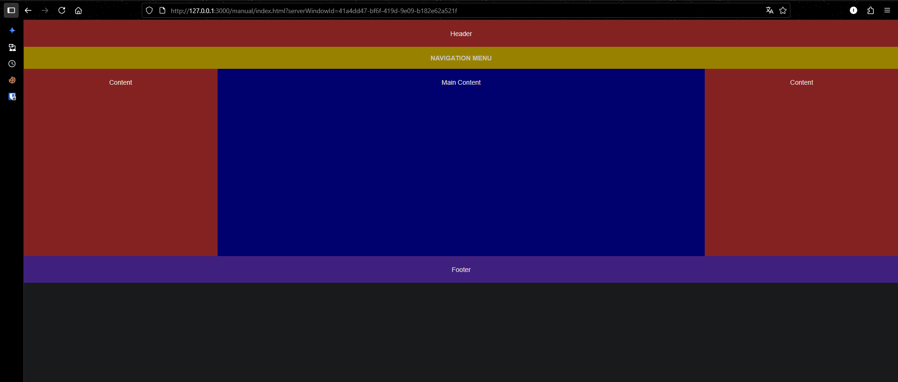
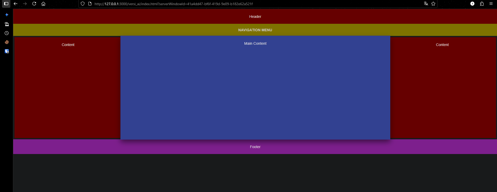

# README.md: Laporan Perbandingan Implementasi Desain Web

### Tugas: 2025/2026-1-05-037-H-1104705: Assignment 2

Dokumen ini memuat analisis perbandingan antara implementasi desain *wireframe* (Header, Navigasi, 3 Kolom Konten, dan Footer) yang dikerjakan secara **Mandiri** (Desain 1) dengan yang dibantu oleh **AI/Gemini** (Desain 2).

---

### 1. Desain yang Diimplementasikan

Berikut adalah tampilan visual dari kedua implementasi untuk perbandingan:

#### A. Desain 1: Implementasi Mandiri

#### B. Desain 2: Implementasi Bantuan AI

---

### 2. Analisis Perbedaan Kunci

| Faktor Perbandingan | Desain 1 (Mandiri) | Desain 2 (Bantuan AI) |
| :--- | :--- | :--- |
| **Waktu Implementasi** | 15 menit, fokus pada *debugging* Flexbox. | 5 menit, didominasi oleh perumusan *prompt*. |
| **Kualitas Sintaks** | Tergantung pada keahlian dan kebiasaan pribadi; rentan terhadap *typo* dan penamaan kelas yang kurang standar. | **Sintaks lebih rapi**, menggunakan penamaan kelas yang konsisten dan elemen **semantik HTML5**. |
| **Kompleksitas Fitur** | Awalnya hanya fokus pada struktur dasar. Fitur interaktif harus ditambahkan secara manual. | Mampu menghasilkan **fitur kompleks** seperti **animasi *hover* (`transition`, `transform`)** dengan mudah sesuai permintaan. |
| **Kebutuhan Debugging**| Tinggi, terutama untuk masalah koneksi file atau *typo* CSS. | Rendah. Kode yang dihasilkan AI cenderung **benar pada upaya pertama**. |
| **Keterangan Kode** | Tidak ada komentar/komentar minim. | Kode dilengkapi untuk menjelaskan setiap blok CSS. |

---

### 3. Kesimpulan dan Refleksi

#### Efisiensi Kerja
Bantuan AI secara signifikan **meningkatkan efisiensi waktu** pengerjaan, terutama untuk struktur *boilerplate* (kode dasar). AI mampu mengubah *prompt* deskriptif menjadi kode yang berfungsi dalam hitungan detik, menghemat waktu yang seharusnya digunakan untuk mengingat sintaks dan *debugging* dasar.

#### Peran dalam Pembelajaran
Proses ini menunjukkan bahwa AI sangat berguna untuk menghasilkan **solusi untuk masalah spesifik** (seperti implementasi animasi *hover*). Kode yang dihasilkan AI (`transition`, `transform`) dapat menjadi **referensi pembelajaran** yang efektif tentang properti CSS yang lebih maju.

#### Peran AI vs. Developer
AI sangat kuat dalam eksekusi teknis (kode bersih dan fitur kompleks), namun **Pemahaman Mandiri** (Desain 1) tetap vital. Pemahaman dasar diperlukan untuk memverifikasi, memodifikasi, dan memberi *prompt* yang akurat kepada AI, memastikan hasil akhirnya sesuai dengan kebutuhan desain.

---

### 4. Detail Pengumpulan

| Item | Detail |
| :--- | :--- |
| **Link Google Drive** | https://docs.google.com/document/d/1EMG7p-VKoTQo7nv-qA1KTbpy2SWuAaS8VclvUxtRSbg/edit?usp=sharing |
